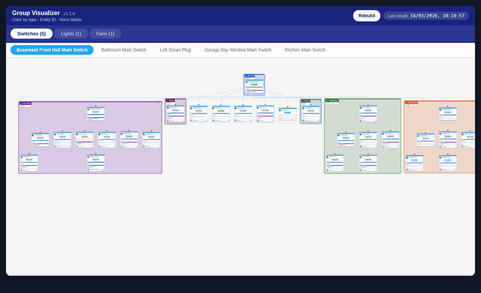

# Groups Visualizer 
http://github.com/leonidostrovski/groups-visualizer

A Home Assistant Lovelace Card for Visualizing Groups and Hierarchies

[](https://github.com/leonidostrovski/groups-visualizer/releases/latest)

Groups Visualizer is a Home Assistant Lovelace card that turns your groups hierarchy into a clear, interactive graph — giving you a complete picture of your smart home hierarchy.

- See all groups, subgroups, lights, switches, fans and sensors in one visual map
- Nodes automatically organized by Home Assistant Area — each area shown as a distinct visual block
- Area voice assistant names displayed directly on the area block — know exactly what to say to control each room
- Group voice assistant names shown on every group node — voice aliases always visible
- Click to toggle entities, click to copy entity IDs, voice names, and aliases
- Don't guess how your groups connect — see the full picture

---

## Screenshots

---

## Installation

### HACS (Recommended)

1. In Home Assistant, open **HACS**
2. Search for **Groups Visualizer** and install it

---

### Adding the Card to the Dashboard

1. Go to **Settings → Dashboards**
2. Select the dashboard where the card should appear
3. Click the three-dots menu (top right) → **Edit Dashboard**
4. Click **+ Add View**
5. In "View Type", select **Panel (single card)**
6. Name the view, for example: `Groups Visualizer`
7. Save the view

Add the card to the new view:

1. Click **Add Card**
2. Select **Manual**
3. Paste:

```yaml
type: custom:groups-visualizer
show_domains: {}
show_voice_labels: true
```
<details>
<summary>Troubleshooting: card not loading?</summary>
  
Hard-refresh your browser (Ctrl+Shift+R / Cmd+Shift+R) if the card doesn't appear

Check that the resource was registered automatically:
**Settings → Dashboards → (three dots) → Resources**

You should see an entry like:
```
/hacsfiles/groups-visualizer/groups-visualizer.js?hacstag=...
```

If it's missing, try reinstalling via HACS or adding it manually.
</details>

---

### Manual Installation (Alternative)

1. Download the latest release from GitHub
2. Copy `groups-visualizer.js` into:

```
/config/www/groups-visualizer/
```

3. Add a resource in Home Assistant:
   **Settings → Dashboards → (three dots) → Resources → Add Resource**

   Resource URL:
   ```
   /local/groups-visualizer/groups-visualizer.js
   ```
   Type: **JavaScript Module**

4. Add the card to any dashboard:

```yaml
type: custom:groups-visualizer
show_domains: {}
show_voice_labels: true
```

---

## Features

### Graph Visualization
- Auto-generated graphs for groups and nested groups
- Cross-area edge routing with corridor separation
- Smooth edges and arrowheads
- Clickable ON/OFF state badges for lights, switches, fans and groups

### Area-Aware Layout
- Nodes grouped visually by Home Assistant Areas
- Styled area boxes with name pill, node count badge, and glow effects
- **Area voice assistant block** — voice aliases shown as chips inside each area box
- Automatic node height measurement
- Dagre compound hierarchical layout

### Node Cards
- Domain color-coded header (LIGHT, SWITCH, GROUP, FAN, SENSOR…)
- Gear icon → opens entity settings dialog
- Friendly name and entity ID (click to copy)
- State badge with live ON/OFF/sensor value + unit of measurement
- Member entity list with state badges (up to 10 shown)
- **Group Labels card** — colored chips for assigned HA labels
- **Group voice assistant card** — voice alias names (click to copy)

### Live Interaction
- Toggle entities directly from the graph (lights, switches, fans, groups)
- Click-to-copy: entity ID, friendly name, voice aliases, area name, area aliases
- Area pen icon → opens area edit popup with entity list and link to area settings
- Automatic state refresh on every hass update (no full rebuild needed)

### User Interface
- Tabs by domain (Lights, Switches, Groups, etc.)
- Sub-tabs for each root group
- Rebuild / Full Rebuild buttons
- Timestamp of last data fetch

---

## Author & AI Transparency

This project was initiated and maintained by:

Email: leonidostrovski@gmail.com
Country: Israel

All source code, architecture, optimization, and documentation were generated with the assistance of AI tools.
Human work was applied for integration, testing, debugging, and verification.

---

## License

This project is licensed under the MIT License.
See the included `LICENSE` file for full details.

---
