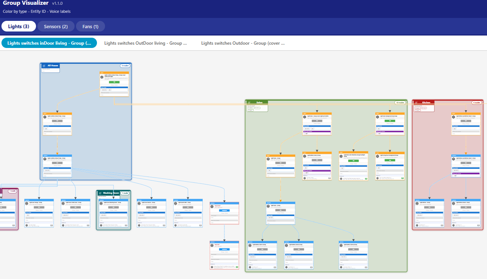

# AI-Generated Project Notice
This project was created entirely with the assistance of AI tools.

---

## Author & AI Transparency

This project was initiated and maintained by:

Email: leonidostrovski@gmail.com  
Country: Israel

All source code, architecture, optimization, and documentation were generated with the assistance of AI tools.  
Human work was applied for integration, testing, debugging, and verification.

---

# Groups Visualizer
A Home Assistant Lovelace Card for Visualizing Groups and Hierarchies
[](https://github.com/leonidostrovski/groups-visualizer/releases/latest)


## Screenshots



`groups-visualizer` is an interactive Lovelace custom card that displays Home Assistant groups, switches, lights, fans, sensors, wrappers, and hierarchical relationships as clean area-aware graph diagrams.

The card automatically reads:
- Entity relationships
- Areas
- Entity registry
- Label registry
- Wrapper pairs (light -> switch mappings)
- Voice labels and aliases

and converts them into a zoomable, multi-layer DAG graph.

---

## Installation

### HACS Installation (Recommended)

1. Open Home Assistant.
2. Go to: **HACS > Frontend > Custom Repositories**.
3. Add this repository as a **Custom Repository** with category: "Lovelace".
4. Install **Groups Visualizer** from HACS.
5. Restart Home Assistant if required.

---

### Adding the Card to the Dashboard

To use the Groups Visualizer, create a new dashboard view:

1. Go to: **Settings > Dashboards**.
2. Select the dashboard where the card should appear.
3. Click the three-dots menu (top right) > **Edit Dashboard**.
4. Click **+ Add View**.
5. In "View Type", select: **Panel (single card)**.
6. Name the view, for example: `Groups Visualizer`.
7. Save the view.

Add the card:

1. Click **Add Card**.
2. Choose **Manual**.
3. Paste:

```yaml
type: custom:groups-visualizer
show_domains: {}
show_voice_labels: true
```

---

## Manual Installation (Alternative)

1. Download the latest ZIP release from GitHub.
2. Extract the `dist/` folder.
3. Copy it into:

```
/config/www/community/groups-visualizer/
```

4. Add this resource in Home Assistant:  
   **Settings > Dashboards > (three dots) > Resources > Add Resource**

Resource URL:

```
/local/community/groups-visualizer/groups-visualizer.js
```

Type must be: **JavaScript Module**

5. Add the card manually to any dashboard:

```yaml
type: custom:groups-visualizer
show_domains: {}
show_voice_labels: true
```

---

## Features

### Graph Visualization
- Auto-generated graphs for groups and nested groups
- Wrapper-pair detection (light wrapping switch)
- Cross-area routing with corridor separation
- Smooth edges and arrowheads
- Clickable ON/OFF badges

### Area-Aware Layout
- Nodes grouped visually by Home Assistant Areas
- Styled area boxes (labels, stripes, glow)
- Automatic foreignObject height measurement
- Dagre hierarchical layout

### User Interface
- Tabs by domain (Lights, Switches, Groups, etc.)
- Sub-tabs for each root group
- Rebuild / Full Rebuild buttons
- Automatic state refresh (no rebuild)

### Entity Registry Info (per node)
- **Hidden badge** — groups hidden in the HA entity registry show a `Hidden` badge with a tooltip explaining the impact
- **Group Labels** — HA entity labels displayed as colored chips
- **Group voice assistant** — entity registry aliases (voice names) shown per group
- **Voice exposure** — shows which voice assistants (Alexa, Google, HA Voice) the group is exposed to, with visual distinction for exposed vs non-exposed

### Live Interaction
- Toggle entities directly from the graph
- Click-to-copy:
  - Entity ID
  - Friendly name
  - Voice label
  - Aliases

### Build System
- Built using Vite
- Produces:
  - groups-visualizer.js (stable)
  - groups-visualizer.<hash>.js (content-hashed)
  - groups-visualizer.<version>.js (versioned)
- Adds auto timestamp banner

---

## Project File Structure

```
groups-visualizer/
+-- dist/                            # Build output
¦   +-- groups-visualizer.js
¦   +-- groups-visualizer.<hash>.js
¦   +-- groups-visualizer.<version>.js
+-- src/
¦   +-- index.js                     # Main Lovelace card (UI, tabs, rebuild)
¦   +-- card-styles.js               # All card styles
¦   +-- card-data.js                 # Loads states, registries, builds tab structure
¦   +-- card-actions.js              # Rendering and state refresh
¦   +-- ha-api.js                    # Entity utilities and helpers
¦   +-- ha-node-table.js             # Node HTML generator
¦   +-- graph.js                     # Graph orchestrator and canvas
¦   +-- graph-layout.js              # Dagre layout generator
¦   +-- graph-render.js              # SVG rendering engine
¦   +-- graph-measure.js             # DOM height measurement engine
¦   +-- constants.js                 # Shared constants
+-- hacs.json                        # HACS metadata
+-- LICENSE                          # MIT License
+-- package.json                     # Project metadata
+-- README.md                        # Documentation
```

---

## License

This project is licensed under the MIT License.  
See the included `LICENSE` file for full details.

---

# Final AI-Generated Notice

This project — including code, structure, and documentation — was generated with the assistance of AI tools.
