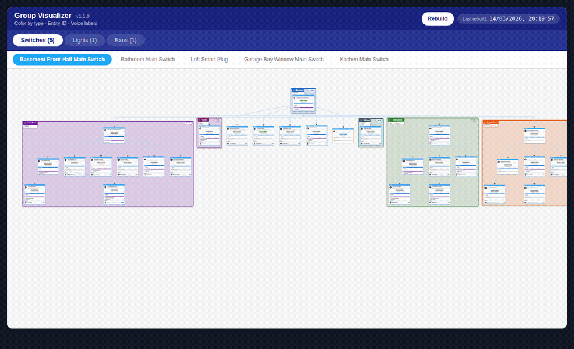

# Groups Visualizer
http://github.com/leonidostrovski/groups-visualizer

A Home Assistant Lovelace Card for Visualizing Groups and Hierarchies

[](https://github.com/leonidostrovski/groups-visualizer/releases/latest)
[](https://github.com/leonidostrovski/groups-visualizer/releases)
[](https://github.com/hacs/integration)

Groups Visualizer helps you understand your Home Assistant setup at a glance.

As your smart home grows, groups, rooms, voice names, and automations quickly become hard to follow. What looks simple at first can turn into guesswork later — especially when something stops working the way you expect.

Groups Visualizer turns that complexity into a clear visual map. You can instantly see how your groups are connected, where each group belongs, how it is named for voice control, and where it is being used in automations.

Instead of digging through menus, YAML, and settings screens, you get one place to understand the structure of your home. That makes it easier to spot mistakes, clean up old setups, and build a smarter system with confidence.

**What you see at a glance:**
- Which groups contain which groups — visualized as a connected tree
- Voice aliases and Default name status per group
- Which automations use each group (trigger / condition / action)
- Area membership with voice aliases
- Live ON/OFF state — toggle directly from the graph

---

## Screenshots


---

## Installation

### HACS (Recommended)

1. In Home Assistant, open **HACS**
2. Search for **Groups Visualizer** and install it

---

### Adding the Card to the Dashboard

1. Go to **Settings → Dashboards**
2. Select the dashboard where the card should appear
3. Click the three-dots menu (top right) → **Edit Dashboard**
4. Click **+ Add View**
5. In "View Type", select **Panel (single card)**
6. Name the view, for example: `Groups Visualizer`
7. Save the view

Add the card to the new view:

1. Click **Add Card**
2. Select **Manual**
3. Paste:

```yaml
type: custom:groups-visualizer
show_domains: {}
show_voice_labels: true
```

<details>
<summary>Troubleshooting: card not loading?</summary>

Hard-refresh your browser (Ctrl+Shift+R / Cmd+Shift+R) if the card doesn't appear.

Check that the resource was registered automatically:
**Settings → Dashboards → (three dots) → Resources**

You should see an entry like:
```
/hacsfiles/groups-visualizer/groups-visualizer.js?hacstag=...
```

If it is missing, add it manually:
1. Go to **Settings → Dashboards → Resources**
2. Click **Add resource**
3. Enter the URL:
   ```
   /hacsfiles/groups-visualizer/groups-visualizer.js?v=1
   ```
4. Set type to **JavaScript module**
5. Save and hard-refresh (Ctrl+Shift+R)

The `?v=1` forces the browser to load a fresh copy. If you update the card in the future and changes don't appear, increment it to `?v=2`, `?v=3`, and so on.

</details>

---

### Manual Installation (Alternative)

1. Download the latest release from GitHub
2. Copy `groups-visualizer.js` into:

```
/config/www/groups-visualizer/
```

3. Add a resource in Home Assistant:
   **Settings → Dashboards → (three dots) → Resources → Add Resource**

   Resource URL:
   ```
   /local/groups-visualizer/groups-visualizer.js
   ```
   Type: **JavaScript Module**

4. Add the card to any dashboard:

```yaml
type: custom:groups-visualizer
show_domains: {}
show_voice_labels: true
```

---

## Features

### Graph Visualization
- Auto-generated graphs for groups and nested groups
- Groups containing `platform: template` sensors are fully supported and displayed as connected nodes in the tree
- Cross-area edge routing with corridor separation
- Smooth edges and arrowheads
- Clickable ON/OFF state badges for lights, switches, fans and groups

### Area-Aware Layout
- Nodes grouped visually by Home Assistant Areas
- Styled area boxes with name pill, node count badge, and glow effects
- **Area voice assistant block** — voice aliases shown as chips inside each area box
- Automatic node height measurement
- Dagre compound hierarchical layout

## Node Cards

Each node in the graph is rendered as a compact card that surfaces the most important information about a single group entity at a glance.

A node card includes the following rows, top to bottom:

- **Domain header** — color-coded by domain (LIGHT, SWITCH, GROUP, FAN, SENSOR…). Shows a `Hidden` badge when the entity is hidden in the HA registry.
- **Gear icon + name / entity ID** — gear icon opens the entity settings dialog. Friendly name and `entity_id` are both clickable to copy.
- **State badge** — current state (`on` / `off` / sensor value with unit). Clickable to toggle for lights, switches, fans and groups.
- **Group stats** — number of child groups and direct member entities (e.g. `2 Groups / 5 Entities`).
- **Group Labels** — colored chips for each HA label assigned to the entity. Shows `None` when no labels are set.
- **Group voice assistant** — voice aliases from the entity registry (click any alias to copy). Shows whether the Default name toggle is enabled or disabled. For light/switch wrapper pairs, aliases from the paired switch are merged in automatically.
- **Voice exposure** — shows which voice assistants the entity is exposed to (Alexa, Google, HA Voice), each as a colored chip. Non-exposed assistants appear at reduced opacity. If voice aliases are defined but the entity is not exposed to any assistant, a warning banner is shown.
- **Used in Automations** — lists every automation that references this group, deduplicated by automation. Each entry shows the automation name (click to copy), section badges (`trigger` / `condition` / `action`) indicating where the group is used, and a ×N count badge if the group appears more than once in the same automation. The pencil icon opens the automation editor in a new browser tab.
- **Member entities** — up to 10 direct member entities, each showing name, entity ID, and state badge. Displays `+N more` when there are more than 10 members.

All data is read from Home Assistant's registries at render time, so changes in Settings are reflected after a Rebuild without reloading the page.

### Live Interaction
- Toggle entities directly from the graph (lights, switches, fans, groups)
- Click-to-copy: entity ID, friendly name, voice aliases, area name, area aliases
- Area pen icon → opens area edit popup with entity list and link to area settings
- Automatic state refresh on every hass update (no full rebuild needed)

### User Interface
- Tabs by domain (Lights, Switches, Groups, etc.)
- Sub-tabs for each root group
- Rebuild / Full Rebuild buttons
- Timestamp of last data fetch

---

## Author & AI Transparency

This project was initiated and maintained by:

Email: leonidostrovski@gmail.com
Country: Israel

All source code, architecture, optimization, and documentation were generated with the assistance of AI tools.
Human work was applied for integration, testing, debugging, and verification.

---

## License

This project is licensed under the MIT License.
See the included `LICENSE` file for full details.

---
